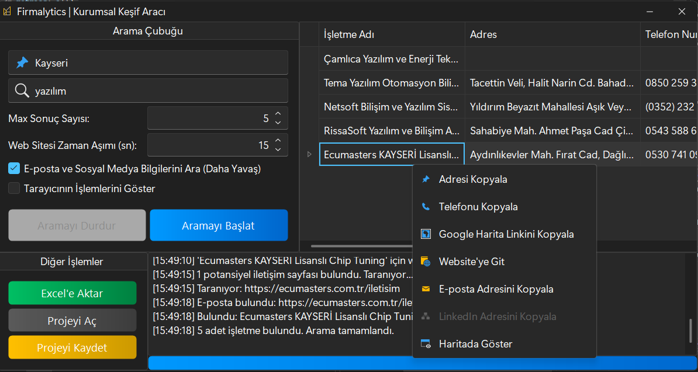

# Firmalytics | Gelişmiş Kurumsal Keşif Aracı

**Firmalytics**, C# WinForms ve Selenium teknolojileri kullanılarak geliştirilmiş, Google Haritalar üzerinden hedef şirket ve işletmelerin temel bilgilerini toplayan ve ardından web sitelerini tarayarak **e-posta** ve **LinkedIn** gibi kritik iletişim bilgilerini çıkaran güçlü bir otomasyon aracıdır. Özellikle B2B satış, pazarlama ve iş geliştirme profesyonelleri için potansiyel müşteri (lead generation) sürecini otomatize etmek ve zenginleştirmek amacıyla tasarlanmıştır.

 

---

## 🚀 Yenilikler (v1.1.0)

*   **Derinlemesine İletişim Bilgisi Taraması:**
    *   Bulunan şirketlerin web sitelerine otomatik olarak giderek **e-posta adreslerini** ve **LinkedIn şirket profillerini** tarar.
    *   Bu özellik, arama başlangıcında isteğe bağlı olarak etkinleştirilebilir.
*   **Gelişmiş Arama Kontrolleri:**
    *   **Görünür/Gizli Tarayıcı Modu:** Otomasyonu, işlem adımlarını görmek için görünür bir Chrome penceresiyle veya daha hızlı ve kaynak-verimli çalışması için arka planda (headless) çalıştırma seçeneği sunar.
    *   **Ayarlanabilir Web Sitesi Zaman Aşımı:** Yavaş yüklenen şirket web siteleri için bekleme süresini (timeout) ayarlama imkanı, bu sayede veri kaybı minimize edilir.
*   **Arayüz ve Kullanılabilirlik İyileştirmeleri:**
    *   Sonuç tablosuna "E-Posta" ve "LinkedIn" kolonları eklendi.
    *   Sağ tık menüsüne "E-posta Kopyala" ve "LinkedIn Kopyala" seçenekleri eklendi.

---

## ✨ Temel Özellikler

*   **Detaylı Bilgi Toplama:** Google Haritalar ve şirket web siteleri üzerinden aşağıdaki verileri otomatik olarak çeker:
    *   İşletme Adı
    *   Tam Adres
    *   Telefon Numarası
    *   Web Sitesi Adresi
    *   **E-Posta Adres(ler)i** *(Yeni!)*
    *   **LinkedIn Şirket Profili** *(Yeni!)*
    *   Google Puanı ve Yorum Sayısı
    *   Google Haritalar Linki
    *   Coğrafi Koordinatlar (Enlem, Boylam)
*   **Akıllı Arama:** Belirtilen şehir ve anahtar kelimeye göre (örn: "Ankara" + "Yazılım Şirketleri") hedefe yönelik arama yapar.
*   **Veri Yönetimi:**
    *   Toplanan verileri modern ve kullanışlı bir grid üzerinde listeler.
    *   Sonuçları tek tıkla **Excel (.xlsx)** formatında dışa aktarma.
    *   Mevcut arama oturumunu **JSON (.json)** formatında proje olarak kaydetme ve daha sonra tekrar açma.
*   **Kullanıcı Dostu Arayüz:**
    *   DevExpress UI kütüphanesi ile şık ve modern bir tasarım.
    *   İşlem adımlarını anlık olarak gösteren log penceresi.
    *   Arama sürecini gösteren ilerleme çubuğu (progress bar).
    *   Grid üzerinde sağ tık menüsü ile "Adresi Kopyala", "Website'ye Git", "E-posta Kopyala" gibi hızlı eylemler.
*   **Sağlam ve Güvenilir Altyapı:**
    *   Google'ın dinamik sayfa yapısına karşı dayanıklı, "Önce Topla, Sonra İşle" mantığı ile geliştirilmiş veri kazıma motoru.
    *   Yaygın otomasyon hatalarına karşı güçlendirilmiş, zaman aşımları ve yeniden deneme mekanizmaları içeren yapı.

---

## 🛠️ Kullanılan Teknolojiler

*   **Platform:** .NET Framework
*   **Dil:** C#
*   **Arayüz:** Windows Forms (WinForms)
*   **UI Kütüphaneleri:** DevExpress WinForms Controls
*   **Web Otomasyonu:** Selenium WebDriver
*   **Veri İşleme:** Newtonsoft.Json

---

## ⚙️ Kurulum ve Kullanım

1.  **Releases** sayfasından en son sürümü indirin.
2.  İndirilen `.zip` dosyasını bir klasöre çıkartın.
3.  `Firmalytics.exe` dosyasını çalıştırın.
4.  "Konum" ve "Anahtar Kelime" alanlarını doldurun.
5.  Maksimum kaç sonuç istediğinizi belirtin.
6.  **Gelişmiş seçenekleri** (E-posta Ara, Tarayıcıyı Göster vb.) isteğinize göre yapılandırın.
7.  "Aramayı Başlat" butonuna tıklayın ve arkanıza yaslanın!

---

## 📜 Lisans

Bu proje MIT Lisansı altında lisanslanmıştır. Detaylar için `LICENSE` dosyasına bakınız.