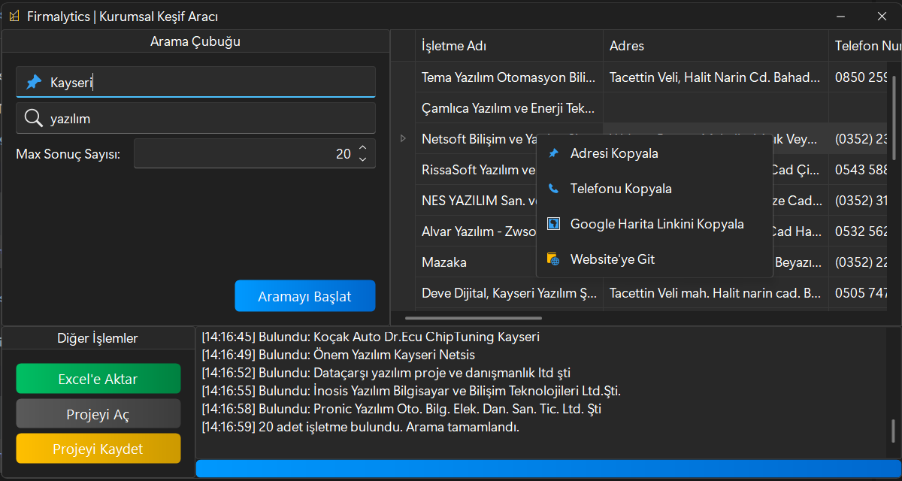

# Firmalytics | Kurumsal Keşif Aracı

**Firmalytics**, C# WinForms ve Selenium teknolojileri kullanılarak geliştirilmiş, Google Haritalar üzerinden hedef şirket ve işletmelerin iletişim bilgilerini, web sitelerini, adreslerini ve daha fazlasını otomatik olarak toplayan güçlü bir otomasyon aracıdır. Özellikle B2B satış, pazarlama ve iş geliştirme profesyonelleri için potansiyel müşteri (lead generation) sürecini otomatize etmek amacıyla tasarlanmıştır.

 

---

## 🚀 Temel Özellikler

*   **Detaylı Bilgi Toplama:** Google Haritalar üzerinden aşağıdaki verileri otomatik olarak çeker:
    *   İşletme Adı
    *   Tam Adres
    *   Telefon Numarası
    *   Web Sitesi Adresi
    *   Google Puanı ve Yorum Sayısı
    *   Google Haritalar Linki
    *   Coğrafi Koordinatlar (Enlem, Boylam)
*   **Akıllı Arama:** Belirtilen şehir ve anahtar kelimeye göre (örn: "Ankara" + "Yazılım Şirketleri") hedefe yönelik arama yapar.
*   **Veri Yönetimi:**
    *   Toplanan verileri modern ve kullanışlı bir grid üzerinde listeler.
    *   Sonuçları tek tıkla **Excel (.xlsx)** formatında dışa aktarma.
    *   Mevcut arama oturumunu **JSON (.json)** formatında proje olarak kaydetme ve daha sonra tekrar açma.
*   **Kullanıcı Dostu Arayüz:**
    *   DevExpress ve Guna2 UI kütüphaneleri ile şık ve modern bir tasarım.
    *   İşlem adımlarını anlık olarak gösteren log penceresi.
    *   Arama sürecini gösteren ilerleme çubuğu (progress bar).
    *   Grid üzerinde sağ tık menüsü ile "Adresi Kopyala", "Website'ye Git" gibi hızlı eylemler.
*   **Sağlam ve Güvenilir Altyapı:**
    *   Google'ın dinamik sayfa yapısına karşı dayanıklı, "Önce Topla, Sonra İşle" mantığı ile geliştirilmiş veri kazıma motoru.
    *   `StaleElementReferenceException` ve `IndexOutOfRangeException` gibi yaygın otomasyon hatalarına karşı güçlendirilmiş yapı.

---

## 🛠️ Kullanılan Teknolojiler

*   **Platform:** .NET Framework
*   **Dil:** C#
*   **Arayüz:** Windows Forms (WinForms)
*   **UI Kütüphaneleri:**
    *   DevExpress WinForms Controls
    *   Guna2 UI Framework
*   **Web Otomasyonu:** Selenium WebDriver
*   **Veri İşleme:** Newtonsoft.Json

---

## ⚙️ Kurulum ve Kullanım

1.  **Releases** sayfasından en son sürümü indirin.
2.  İndirilen `.zip` dosyasını bir klasöre çıkartın.
3.  `Firmalytics.exe` dosyasını çalıştırın.
4.  "Konum" ve "Anahtar Kelime" alanlarını doldurun.
5.  Maksimum kaç sonuç istediğinizi belirtin.
6.  "Aramayı Başlat" butonuna tıklayın ve arkanıza yaslanın!

---

## 📸 Ekran Görüntüleri

*(Buraya programınızdan birkaç farklı ekran görüntüsü ekleyebilirsiniz. Örneğin, ana arayüz, sağ tık menüsü, Excel çıktısı vb.)*

---

## 📜 Lisans

Bu proje MIT Lisansı altında lisanslanmıştır. Detaylar için `LICENSE` dosyasına bakınız.